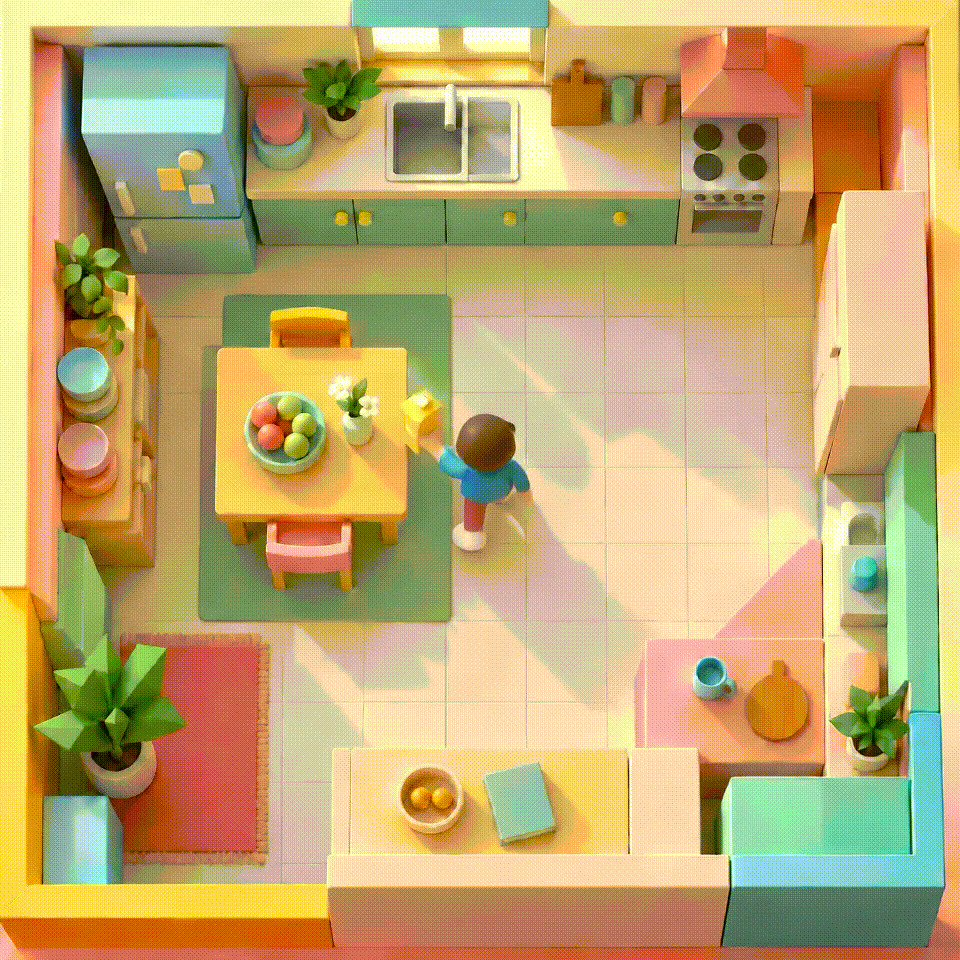

<div align="center">

<h1>👀 Long Time No See:<br>Benchmarking VLMs for Out-of-Sight Spatiotemporal Reasoning in Egocentric Videos</h1>

<p>
  <a href="#citation"></a>
  <a href="https://beyond3d-bench.github.io/website/"></a>
  <a href="https://huggingface.co/datasets/Ffffangzhu/BEYOND3D"></a>
  <a href="https://github.com/Zoulution/oos_vlm_evaluation"></a>
</p>

<p>
Fangzhou Ma<sup>1*</sup> · Ivo Alexander Ban<sup>1*</sup> · <a href="https://erenhomburg.com/">Eren Homburg</a><sup>1*</sup> · <a href="https://gabrielegoletto.github.io/">Gabriele Goletto</a><sup>2</sup><br>
<a href="https://rpautrat.github.io/">Rémi Pautrat</a><sup>2</sup> · <a href="https://radmahdi.github.io/Home.html">Mahdi Rad</a><sup>2</sup> · <a href="https://chiaraplizz.github.io/">Chiara Plizzari</a><sup>3</sup> · <a href="https://people.inf.ethz.ch/pomarc/">Marc Pollefeys</a><sup>1,2</sup>
</p>

<p><sup>1</sup> ETH Zurich · <sup>2</sup> Microsoft Spatial AI Lab · <sup>3</sup> Bocconi University<br>
<sup>*</sup> Equal contribution.</p>


<br>

</div>

## Contents

- [Benchmark](#benchmark)
- [Results](#results)
- [Run Your Own Evaluation](#run-your-own-evaluation)
  - [Installation](#installation)
  - [Evaluation](#evaluation)
    - [Slurm](#slurm)
- [Repository Structure](#repository-structure)
- [Optional Configuration](#optional-configuration)
- [Acknowledgements](#acknowledgements)
- [Citation](#citation)

<a id="benchmark"></a>

## 🧩 BEYOND3D

This repository provides the evaluation code for **BEYOND3D**, the benchmark introduced in our paper.
Built on **HD-EPIC** egocentric kitchen videos, it tests whether VLMs can track relocated objects
and reason about their last known spatial state after they leave view. The questions probe four capabilities: **visual grounding**, **temporal grounding**,
**scene localization**, and **3D spatial perception**. Models must recover when an object
was last visible or placed, identify its location in the scene, and estimate its direction
and distance relative to the camera or another object.

The evaluation set contains **8,000 out-of-sight questions** from 1,000 query anchors,
plus **1,000 visible controls** for the visibility question. Geometry-aware visibility
tracks and manual inspection establish that the out-of-sight targets are no longer
observable at query time.

<a id="results"></a>

## 📊 Results at a glance

Across the nine VLMs evaluated in the paper, the best model, **Qwen-3.6-27B**, reaches
**42.2% macro accuracy**, compared with **29.7% random guessing**. Recovering past events
and retaining updated spatial state remain challenging, especially as objects stay
out of sight for longer.

We report the mean accuracy across the eight question types, giving each type equal
weight. Models receive the video prefix up to the query time, with frame subsampling
where required by their context limits.

Explore question examples and detailed results on the
[project website](https://beyond3d-bench.github.io/website/).

<a id="run-your-own-evaluation"></a>

## 🏃 Run Your Own Evaluation

<a id="installation"></a>

## 🛠️ Setup

Requires Linux x86-64, Python 3.10+, and an NVIDIA GPU with a CUDA 12.8-compatible driver.
The setup script uses `uv`; no Conda or root installation is needed. A C compiler
(`cc`) and `make` are required to build the bundled FFmpeg libraries.

Run setup on a machine with Internet access. It creates or reuses the selected
model's locked Python environment, downloads its checkpoint and any required source
code or auxiliary weights, then downloads the preprocessed BEYOND3D videos and VQA
files from Hugging Face (currently about 2.6 GB). Finally, it checks the environment
and video decoder.

### One model

```bash
git clone https://github.com/Zoulution/oos_vlm_evaluation.git
cd oos_vlm_evaluation

# Choose a directory with enough space for environments, checkpoints, and caches.
export OOS_STORAGE_ROOT="/absolute/path/to/storage"

# Create the environment, download checkpoints,
# required model source, and the BEYOND3D dataset (VQA + preprocessed videos), then verify the installation.
bash setup.sh --model qwen3_5_9b
```

Hugging Face downloads are stored in `$OOS_STORAGE_ROOT/hf_cache/hub`. After setup,
evaluation can run on a compute node without downloading anything.

### All supported models

Run `bash setup.sh --all` to prepare every model. VLM-3R setup installs its pinned
CUDA compiler in user storage; its CUDA extension is built on the first GPU run.

### Storage

Approximate model-download storage for one preset (environment, dataset, and outputs are extra):

| Preset | Downloaded artifacts | Storage |
| --- | --- | ---: |
| `qwen3_5_9b` | Qwen3.5-9B | 20 GB |
| `qwen3_6_27b` | Qwen3.6-27B | 56 GB |
| `qwen3_6_35b_a3b` | Qwen3.6-35B-A3B | 72 GB |
| `qwen3_vl` | Qwen3-VL-8B-Instruct | 18 GB |
| `internvl` | InternVL3.5-8B-HF | 18 GB |
| `sensenova_qwen` | SenseNova-SI-1.3-Qwen3-VL-8B | 18 GB |
| `cambrian_p` | Cambrian-P-7B | 16 GB |
| `spatial_mllm` | Spatial-MLLM-v1.1 | 12 GB |
| `vlm3r` | VLM-3R-LLaVA-Qwen2-LoRA, LLaVA-NeXT-Video-7B-Qwen2, SigLIP-SO400M-Patch14-384, and CUT3R-512-DPT-4-64 | 24 GB |

A single-model setup needs the corresponding model download, its environment, and
the 2.6 GB dataset. `bash setup.sh --all` instead downloads all model checkpoints
(about 248 GB), required external source code and auxiliary weights (about 4 GB),
and environments for every preset (about 12 GB). Evaluation outputs require
additional space.


<a id="evaluation"></a>

## ▶️ Evaluate

To evaluate the baseline dataset with videos and text, run:

```bash
# After setup, on a GPU compute node with the shared cache and checkpoints:
OOS_MODEL=qwen3_5_9b OOS_OFFLINE=1 bash launchers/run_oos_eval.sh
```

To evaluate the temporal-cues variant shipped with BEYOND3D, set
`OOS_DATASET_FILE=vqa_temporal_cues.jsonl`. Setup downloads both VQA files and
their shared videos, so this does not require another download.

`OOS_DATASET_JSONL` is only needed to evaluate a customized local dataset; see the
[dataset format reference](docs/dataset.md).

Results: `outputs/oos_videoqa/<model>/` in the repository.
Questions run independently with `prefix` video context.

### 🖥️ Slurm

Adjust resources in [the job script](launchers/slurm_oos_eval.sh). After setup:

```bash
mkdir -p logs
OOS_MODEL=qwen3_5_9b OOS_LIMIT=2 OOS_OFFLINE=1 sbatch launchers/slurm_oos_eval.sh

# After setup.sh --all: test two questions per model.
OOS_OFFLINE=1 bash launchers/submit_oos_smoke_tests.sh --all --limit 2
```

Logs: `logs/oos_videoqa_<job-id>.{out,err}`. Omit `OOS_LIMIT` for a full single-model run.

<a id="repository-structure"></a>

## 🗂️ Repository structure

| Path | Purpose |
| --- | --- |
| [launchers/](launchers/) | Commands for local and Slurm evaluation; [model presets](launchers/models/) define how each model is launched. |
| [models/manifest.yaml](models/manifest.yaml) | Pinned model checkpoints and external source revisions used by setup. |
| [lmms_eval/](lmms_eval/) | The evaluation framework, including the BEYOND3D task and model adapters. |
| [tools/](tools/) | Setup, download, dataset-resolution, and verification utilities. |
| [environments/](environments/) | Locked Python dependency specifications for the supported model environments. |
| [docs/](docs/) | Dataset format and other reference documentation. |

<a id="optional-configuration"></a>

## ⚙️ Optional configuration

The setup and evaluation commands above work without configuration. Optionally add
variables to `.env` to avoid repeating `export` commands; see
[.env.example](.env.example) for an example. Both `setup.sh` and the evaluation
launchers load this file automatically.

- Set `OOS_STORAGE_ROOT` to choose where setup stores environments, model files,
  and downloaded benchmark data; evaluation uses the same location.
- Set `OOS_DATASET_JSONL` only to evaluate a customized local dataset instead of
  the BEYOND3D data downloaded during setup.

Other model-specific launch settings are documented in
[launchers/models/](launchers/models/).

<a id="citation"></a>

## 📖 Citation

If you use this code or benchmark, please cite:

```bibtex
@misc{ma2026longtime,
  title  = {Long Time No See: Benchmarking VLMs for Out-of-Sight Spatiotemporal Reasoning in Egocentric Videos},
  author = {Ma, Fangzhou and Ban, Ivo Alexander and Homburg, Eren and Goletto, Gabriele and Pautrat, R\'emi and Rad, Mahdi and Plizzari, Chiara and Pollefeys, Marc},
  year   = {2026},
  note   = {Manuscript}
}
```

Machine-readable metadata is available in [CITATION.cff](CITATION.cff).

<a id="acknowledgements"></a>

## 🙏 Acknowledgements

We are grateful to the [HD-EPIC](https://hd-epic.github.io/site/) team for their
rich collection of videos, annotations, and digital twins. BEYOND3D is built on
these remarkable assets.

We also thank the [lmms-eval](https://github.com/EvolvingLMMs-Lab/lmms-eval) team
for the evaluation framework that this repository extends. See [LICENSE](LICENSE)
and [CITATION.cff](CITATION.cff) for attribution and licensing details.

## 📄 License

Our original contributions are licensed under [MIT](LICENSE).
Inherited lmms-eval code retains its MIT or Apache-2.0 license;
see [upstream notices](LICENSES/lmms-eval.txt).
