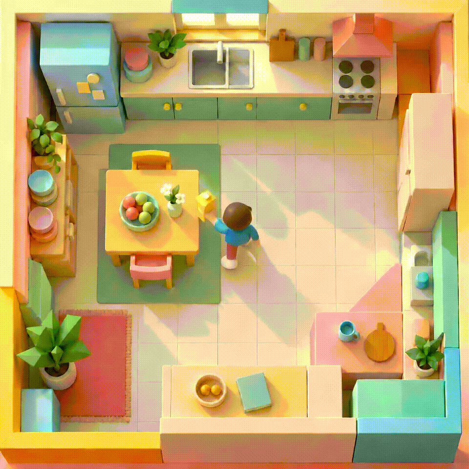

<div align="center">

<h1>👀 Long Time No See:<br>Benchmarking VLMs for Out-of-Sight Spatiotemporal Reasoning in Egocentric Videos</h1>

<p>
  <a href="https://arxiv.org/abs/2609.34630"></a>
  <a href="https://beyond3d-bench.github.io/website/"></a>
  <a href="https://huggingface.co/datasets/Ffffangzhu/BEYOND3D"></a>
</p>

<p>
Fangzhou Ma<sup>1*</sup> · <a href="https://ivo-ab.github.io/">Ivo Alexander Ban</a><sup>1*</sup> · <a href="https://erenhomburg.com/">Eren Homburg</a><sup>1*</sup> · <a href="https://gabrielegoletto.github.io/">Gabriele Goletto</a><sup>2</sup><br>
<a href="https://rpautrat.github.io/">Rémi Pautrat</a><sup>2</sup> · <a href="https://radmahdi.github.io/Home.html">Mahdi Rad</a><sup>2</sup> · <a href="https://chiaraplizz.github.io/">Chiara Plizzari</a><sup>3</sup> · <a href="https://people.inf.ethz.ch/pomarc/">Marc Pollefeys</a><sup>1,2</sup>
</p>

<p><sup>1</sup> ETH Zürich · <sup>2</sup> Microsoft Spatial AI Lab · <sup>3</sup> Bocconi University<br>
<sup>*</sup> Equal contribution.</p>


<br>

</div>

## Contents

- [Benchmark](#benchmark)
- [Results](#results)
- [Run Your Own Evaluation](#run-your-own-evaluation)
  - [Setup](#setup)
  - [Evaluation](#evaluation)
    - [Slurm](#slurm)
- [Repository Structure](#repository-structure)
- [Optional Configuration](#optional-configuration)
- [Acknowledgements](#acknowledgements)
- [Citation](#citation)

<a id="benchmark"></a>

## 🧩 BEYOND3D

This repository provides the evaluation code for **BEYOND3D**, the benchmark introduced in our paper.
Built on **HD-EPIC** egocentric kitchen videos, it tests whether VLMs can track relocated objects
and reason about their last known spatial state after they leave view. The questions probe four capabilities: **visual grounding**, **temporal grounding**,
**scene localization**, and **3D spatial perception**. Models must recover when an object
was last visible or placed, identify its location in the scene, and estimate its direction
and distance relative to the camera or another object.

The evaluation set contains **8,000 out-of-sight questions** from 1,000 query anchors,
plus **1,000 visible controls** for the visibility question. Geometry-aware visibility
tracks and manual inspection establish that the out-of-sight targets are no longer
observable at query time.

<a id="results"></a>

## 📊 Results at a glance

Across the nine VLMs evaluated in the paper, the best model, **Qwen-3.6-27B**, reaches
**42.2% macro accuracy**, compared with **29.7% random guessing**. Recovering past events
and retaining updated spatial state remain challenging, especially as objects stay
out of sight for longer.

We report the mean accuracy across the eight question types, giving each type equal
weight. Models receive the video prefix up to the query time, with frame subsampling
where required by their context limits.

Explore question examples and detailed results on the
[project website](https://beyond3d-bench.github.io/website/).

<a id="run-your-own-evaluation"></a>

## 🏃 Run Your Own Evaluation

<a id="setup"></a>

## 🛠️ Setup

Requires Linux x86-64, Python 3.10+, and an NVIDIA GPU with a CUDA 12.8-compatible driver.
The setup script uses `uv`; no Conda or root installation is needed. A C compiler
(`cc`) and `make` are required to build the bundled FFmpeg libraries.

Run setup on a machine with Internet access. It prepares the selected model,
fetches the benchmark annotations from Hugging Face, and downloads and preprocesses
the evaluation videos. Prepare the required HD-EPIC intermediate data as described below before the first evaluation run.

### Prepare videos

You will need approximately **120 GiB of free disk space** for dataset preparation. The original HD-EPIC videos require about **115 GiB**, and the extracted intermediate data about **2.2 GiB**.

Choose a storage directory. The same location will later be used for model checkpoints, environments, and caches:

```bash
export OOS_STORAGE_ROOT="/absolute/path/to/storage"
```

Download the [HD-EPIC intermediate data](https://uob-my.sharepoint.com/:f:/g/personal/jc17360_bristol_ac_uk/IgCCGb5qDbiOR7cmj1R9OyUWAXQFYL7FP_d0eMzB4ENPVQk?e=8SoGEy). If the link requires sign-in, see the [official HD-EPIC annotations README](https://github.com/hd-epic/hd-epic-annotations/blob/main/README.md).

Extract the participant ZIP files to:

```text id="fxabiv"
$OOS_STORAGE_ROOT/data/HD-EPIC/Intermediate_data/
```

Expected layout:

```text id="var7ub"
$OOS_STORAGE_ROOT/data/HD-EPIC/Intermediate_data/
├── P01/
│   └── P01-<YYYYMMDD>-<HHMMSS>/
│       └── device_calibration.json
├── P02/
│   └── P02-<YYYYMMDD>-<HHMMSS>/
│       └── device_calibration.json
└── ...
```

Each participant folder (`P01`–`P09`) should contain one folder per video, with its corresponding `device_calibration.json`.

Then run:

```bash
bash setup.sh --data-only
```

This downloads `vqa_baseline.jsonl` and `vqa_temporal_cues.jsonl` from Hugging Face into:

```text
$OOS_STORAGE_ROOT/data/BEYOND3D/
```

It also downloads the required HD-EPIC videos and preprocesses them for evaluation by resizing them to **448×448 at 1 FPS**, adding timestamps to each frame, and masking the black regions outside the Aria glasses' circular fisheye field of view.

By default, setup uses **8 parallel workers for downloading and 8 for preprocessing**. To change the parallelism:

```bash
OOS_VIDEO_DOWNLOAD_WORKERS=4 OOS_VIDEO_PREP_WORKERS=16 \
bash setup.sh --data-only
```

After setup, the original HD-EPIC videos are stored under:

```text
$OOS_STORAGE_ROOT/data/HD-EPIC/Videos/Pxx/<video_id>.mp4
```

and the processed BEYOND3D videos under:

```text
$OOS_STORAGE_ROOT/data/BEYOND3D/videos/<video_id>.mp4
```

### Prepare one model
To set up a single model:
```bash
git clone https://github.com/Beyond3D-bench/vlm-evaluation.git
cd vlm-evaluation

export OOS_STORAGE_ROOT="/absolute/path/to/storage"

bash setup.sh --model qwen3_5_9b --skip-data
```

The setup script creates the model environment, downloads the required checkpoint and dependencies, and verifies the installation.

Model downloads are stored in `$OOS_STORAGE_ROOT/hf_cache/hub`. Since the benchmark data was prepared above, `--skip-data` skips data preparation. After setup completes, evaluation can
run offline.

### Prepare all models

After preparing the data above, run `bash setup.sh --all --skip-data` to prepare every model. VLM-3R setup installs its pinned
CUDA compiler in user storage; its CUDA extension is built on the first GPU run.

### Storage

Approximate model-download storage for one preset (environment, dataset, and outputs are extra):

| Preset | Downloaded artifacts | Storage | Source |
| --- | --- | ---: | --- |
| `qwen3_5_9b` | Qwen3.5-9B | 20 GB | [Checkpoint](https://huggingface.co/Qwen/Qwen3.5-9B) |
| `qwen3_6_27b` | Qwen3.6-27B | 56 GB | [Checkpoint](https://huggingface.co/Qwen/Qwen3.6-27B) |
| `qwen3_6_35b_a3b` | Qwen3.6-35B-A3B | 72 GB | [Checkpoint](https://huggingface.co/Qwen/Qwen3.6-35B-A3B) |
| `qwen3_vl` | Qwen3-VL-8B-Instruct | 18 GB | [Checkpoint](https://huggingface.co/Qwen/Qwen3-VL-8B-Instruct) |
| `internvl` | InternVL3.5-8B-HF | 18 GB | [Checkpoint](https://huggingface.co/OpenGVLab/InternVL3_5-8B-HF) |
| `sensenova_qwen` | SenseNova-SI-1.3-Qwen3-VL-8B | 18 GB | [Checkpoint](https://huggingface.co/sensenova/SenseNova-SI-1.3-Qwen3-VL-8B) |
| `cambrian_p` | Cambrian-P-7B | 16 GB | [Checkpoint](https://huggingface.co/nyu-visionx/Cambrian-P-7B) · [Code](https://github.com/cambrian-mllm/cambrian-p) |
| `spatial_mllm` | Spatial-MLLM-v1.1 | 12 GB | [Checkpoint](https://huggingface.co/Diankun/Spatial-MLLM-v1.1-Instruct-820K) · [Code](https://github.com/THU-SI/Spatial-MLLM) |
| `vlm3r` | VLM-3R-LLaVA-Qwen2-LoRA, LLaVA-NeXT-Video-7B-Qwen2, SigLIP-SO400M-Patch14-384, and CUT3R-512-DPT-4-64 | 24 GB | [Checkpoint](https://huggingface.co/Journey9ni/vlm-3r-llava-qwen2-lora) · [Code](https://github.com/VITA-Group/VLM-3R) |

Setup also clones the linked code repositories for Cambrian-P, Spatial-MLLM,
and VLM-3R at the revisions pinned in [models/manifest.yaml](models/manifest.yaml).

A single-model setup needs the corresponding model download, its environment, and
the annotations, original HD-EPIC videos, and processed videos. `bash setup.sh --all` instead downloads all model checkpoints
(about 248 GB), required external source code and auxiliary weights (about 4 GB),
and environments for every preset (about 12 GB). Evaluation outputs require
additional space.


<a id="evaluation"></a>

## ▶️ Evaluate

To evaluate the baseline dataset with videos and text, run:

```bash
# After setup, on a GPU compute node with the shared cache and checkpoints:
OOS_MODEL=qwen3_5_9b OOS_OFFLINE=1 bash launchers/run_oos_eval.sh
```

To evaluate the temporal-cues variant shipped with BEYOND3D, set
`OOS_DATASET_FILE=vqa_temporal_cues.jsonl`. Setup prepares both variants and their
shared videos.

`OOS_DATASET_JSONL` is only needed to evaluate a customized local dataset; see the
[dataset format reference](docs/dataset.md).

Results: `outputs/oos_videoqa/<model>/` in the repository.
Questions are evaluated independently using the corresponding video prefix as context.

<a id="slurm"></a>
### 🖥️ Slurm

Adjust resources in [the job script](launchers/slurm_oos_eval.sh). After setup:

```bash
mkdir -p logs
OOS_MODEL=qwen3_5_9b OOS_LIMIT=2 OOS_OFFLINE=1 sbatch launchers/slurm_oos_eval.sh

# After setup.sh --all: test two questions per model.
OOS_OFFLINE=1 bash launchers/submit_oos_smoke_tests.sh --all --limit 2
```

Logs: `logs/oos_videoqa_<job-id>.{out,err}`. Omit `OOS_LIMIT` for a full single-model run.

<a id="repository-structure"></a>

## 🗂️ Repository structure

| Path | Purpose |
| --- | --- |
| [launchers/](launchers/) | Commands for local and Slurm evaluation; [model presets](launchers/models/) define how each model is launched. |
| [models/manifest.yaml](models/manifest.yaml) | Pinned model checkpoints and external source revisions used by setup. |
| [lmms_eval/](lmms_eval/) | The evaluation framework, including the BEYOND3D task and model adapters. |
| [tools/](tools/) | Setup, download, dataset-resolution, and verification utilities. |
| [environments/](environments/) | Locked Python dependency specifications for the supported model environments. |
| [docs/](docs/) | Dataset format and other reference documentation. |

<a id="optional-configuration"></a>

## ⚙️ Optional configuration

Optionally save settings in `.env` to avoid repeating shell exports; see
[.env.example](.env.example). Both `setup.sh` and the evaluation launchers load
this file automatically.

- `OOS_STORAGE_ROOT` sets the storage location for environments, model files,
  caches, and benchmark data. Setup and evaluation use the same location.
- `OOS_VIDEO_PREP_WORKERS` sets the number of video preprocessing workers
  (default: `8`).
- `OOS_VIDEO_DOWNLOAD_WORKERS` sets the number of video download workers
  (default: `8`).

To evaluate a customized local dataset, set `OOS_DATASET_JSONL`; see the
[dataset format reference](docs/dataset.md). Standard BEYOND3D evaluation automatically uses the data downloaded during setup.

Other model-specific launch settings are documented in
[launchers/models/](launchers/models/).


<a id="acknowledgements"></a>

## 🙏 Acknowledgements

We are grateful to the [HD-EPIC](https://hd-epic.github.io/site/) team for their
rich collection of videos, annotations, and digital twins. BEYOND3D is built on
these remarkable assets.

We also thank the [lmms-eval](https://github.com/EvolvingLMMs-Lab/lmms-eval) team
for the evaluation framework that this repository extends. See [LICENSE](LICENSE)
and [CITATION.cff](CITATION.cff) for attribution and licensing details.

We thank Xiaoxuan Cheng (ETH Zürich) for assistance with executing experiments on the cluster.

<a id="citation"></a>

## 📖 Citation

If you use this code or benchmark, please cite:

```bibtex
@misc{ma2026beyond3d,
  title        = {Long Time No See: Benchmarking VLMs for Out-of-Sight Spatiotemporal Reasoning in Egocentric Videos},
  author       = {Fangzhou Ma and Ivo Alexander Ban and Eren Homburg and Gabriele Goletto and Rémi Pautrat and Mahdi Rad and Chiara Plizzari and Marc Pollefeys},
  year         = {2026},
  eprint       = {2609.34630},
  archivePrefix = {arXiv},
  primaryClass = {cs.CV},
  url          = {https://arxiv.org/abs/2609.34630}
}
```

Machine-readable metadata is available in [CITATION.cff](CITATION.cff).

## 📄 License

Our original contributions are licensed under [MIT](LICENSE).
Inherited lmms-eval code retains its MIT or Apache-2.0 license;
see [upstream notices](LICENSES/lmms-eval.txt).
